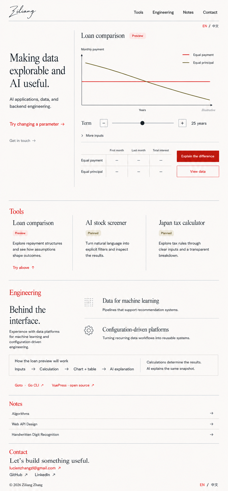
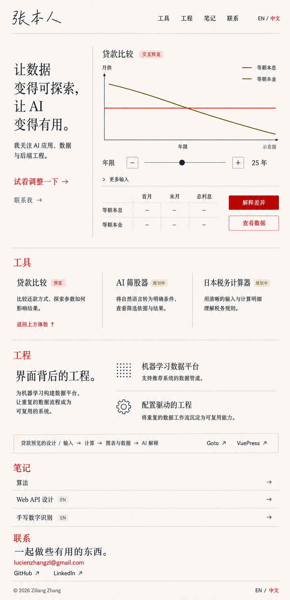
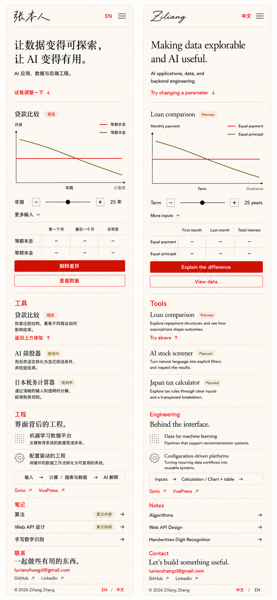

> 最新决策（2026-09-05）：A v2 已获确认；以 [设计规格](./homepage-design-spec.md)、[验收清单](./homepage-acceptance.md) 和 [实现交接](./homepage-implementation-handoff.md) 为当前执行依据。下文早期停止点保留为阶段历史。

# Phase 5A.2 — A 方案完整页面深化

日期：2026-09-05。状态：用户已确认 A v2 完整设计；已授权交接与隔离原型。仅设计文档与效果图，没有修改正式主页、依赖或全站主题，没有启动 `/goal`。

## 0. 蓝笔反馈修订（v2，2026-09-05）

用户在英文桌面稿标注了站点标题、章节编号与字号、页脚 copyright，要求中英文及移动同步调整。以下三张已切换为 v2，旧图片保留用于比较。提示词见 [prompts-v2.json](./a-refinement/prompts-v2.json)，使用内置 ImageGen。

- **站点品牌恢复原站文字与字体。** `docs/.vuepress/config.ts:75` 英文为 `Ziliang`，`:80` 中文为 `张本人`；`docs/.vuepress/styles/index.scss` 已声明 Sacramento（英文 1.8rem）与 Slidefu（中文 2rem）。下一步原型直接复用已有本地字体，不新增相似字体。Slidefu 的 unicode-range 恰好覆盖“张本人”，不能用它声称完整显示“张子良”。手写字体仅用于站点品牌，正文与内容标题沿 A 排版。图片只能近似字形。
- **取消装饰编号，加强区块层级。** Hero、工具、工程、笔记、联系及笔记行的序号全部取消；这些内容没有步骤顺序。内部区块标题拟桌面 24–28px、移动 20–24px，保持明显小于主标题；顶部导航仍约 14–16px、近黑色。以字号、分隔与留白建立层级，不把全页标题一起放大。具体字号待真实视口验证。
- **页脚加入简洁署名。** 中英文均用 `© 2026 Ziliang Zhang`，作为低调的站点归属标识，14px 左右；无需增加长段声明。年份为本次设计稿年份；原型在构建时输出当前年份并保持 SSR 与 hydration 一致。不因添加这一行而修改现有内容或代码许可证。

本轮三张图均已检查，用户标注对应的修改已呈现；仍有生成局限：英文桌面语言切换被放到导航下一行（原型应同一行）；中文桌面文章语言标签位置错误（应算法与 Web API 两条显示“英文内容”，手写数字识别不显示）；移动英文工程流程漏了末尾 AI explanation（原型须保留并换行）。部分区块标题仍生成了衬线效果，最终统一为清晰的无衬线区块标签、保留 A 的衬线主标题。以下第 6 节为 v1 审查历史，已在 v2 修复的项目不再视为当前错误；尚未实测的浏览器与无障碍要求继续有效。

## 1. 本轮决定

沿用 A 的暖白、朱红、编辑式标题与开放图表。用户喜欢其舒适度和明确焦点，不引入 B/C 的仪表盘密度、复杂注释体系或科技装饰。技术含金量来自可操作的比较、清晰的数据依据、工程经历和开源链接。

使用内置 ImageGen 生成并检查图片；精确提示词保存于 [prompts.json](./a-refinement/prompts.json)。这些是静态设计效果图，并非浏览器截图、可运行 demo 或已通过响应式验收的页面。图片文字有生成误差，内容与行为以本文及 [IA](./homepage-ia.md) 为准。

## 2. 完整页面

### 英文桌面

### 中文桌面

### 中英文移动端

## 3. 页面节奏与内容

| 区域 | 内容与目的 | 深化决定 |
| --- | --- | --- |
| 首屏 | 姓名、技术定位、贷款比较体验 | 桌面约 1:2 分栏；移除装饰编号，标题与图表成为焦点；移动端先短介绍再图表 |
| 工具 | 贷款比较、AI 筛股器、日本税务计算器 | 桌面开放三栏，移动端三行；规划项目无伪体验入口 |
| 工程 | 机器学习数据平台、配置驱动工程、Goto 与 VuePress | 两段简短经历与真实开源链接，不堆技术 logo、不虚构指标 |
| 笔记 | 算法、Web API 设计、手写数字识别 | 三条轻量目录；中文前两条标明“英文内容” |
| 联系 | Gmail、GitHub、LinkedIn | 独立且舒展的收尾，邮箱完整可见，无微信二维码 |

首屏中文主张：“让数据变得可探索，让 AI 变得有用。”英文为 “Making data explorable and AI useful.” 首要行动是“试着调整一下 / Try changing a parameter”，将焦点移到年限控件；联系为次要入口。工具区贷款链接才使用“返回上方体验 / Try above”。

邮箱严格使用 `lucienzhangzl@gmail.com`，链接为 `mailto:lucienzhangzl@gmail.com`。其他联系链接：[GitHub](https://github.com/LucienZhang)、[LinkedIn](https://www.linkedin.com/in/zhang-ziliang/)。经历依据 2025 年 5 月简历，仅陈述已知经历，不暗示目前雇佣状态或当前项目进度。

贷款“预览”表示拟实现的主页内体验，独立完整工具页仍待开发。筛股器与税务工具显示“规划中”。图中 25 年仅是场景占位，不是最终默认值；线条是示意图，金额为横线，不可作为计算结果。

工程流程“输入 → 计算 → 图表与数据 → AI 解释”表达拟实现的设计。实际计算必须先独立成立，AI 只解释同一份结果快照，不能生成或更改计算结果。Goto 链接使用 `https://github.com/LucienZhang/goto`；VuePress 贡献可使用 `https://github.com/vuepress/vuepress-next/pull/460`。

文章链接沿用 IA：`/programming/algorithms/overview.html`、`/misc/apis.html`、`/ml/mnist.html`；中文 MNIST 使用 `/zh/ml/mnist.html`。不根据图片生成的关键词扩充文章内容承诺。

## 4. 解释面板深化

沿用 [A 原始效果图中的展开面板](./visual-directions/a-exhibition.png)：暖白底、朱红顶线、简短正文、指标引用与输入框。位置紧接图表和结果表，属于正文流；移动端自然向下展开，无浮动聊天窗、遮罩或全屏弹层。

| 状态 | 呈现与行为 |
| --- | --- |
| 初始 | 只有“解释差异”入口，不额外显示第二个 AI 折叠栏 |
| 展开 | 标题“示例解释 · AI 未连接 / Example explanation · AI not connected”；推荐问题、输入框、发送、关闭 |
| 示例回答 | 简短说明两种还款结构；“首月”“总利息”引用仅指向实际表中对应指标，当前占位阶段不输出金额比较结论 |
| 生成中 | 模拟状态显示“正在生成示例解释”，允许取消；不使用连续打字作为屏幕阅读器公告 |
| 参数已更改 | 保留回答并标记“基于之前的参数”，提供“更新解释”；不自动调用或自动重新生成 |
| 错误与重试 | 就地短消息与重试，计算和图表继续可用；超时、限流仅在原型测试控制中触发 |
| 关闭与焦点 | 开启后聚焦面板，关闭后回到触发按钮；无焦点陷阱，键盘可继续浏览后续内容 |

第一轮原型仍用明确标注的 mock；所有真实模型、股票数据与税务规则接入另行实施。reduced-motion 下直接更新数据和文本，不插值曲线或强制平滑滚动。

## 5. 全站配色建议

建议统一基础视觉语言，但分阶段落实。主页和未来工具页采用这套暖白与朱红；文章页共享强调色、背景倾向、导航、链接与键盘焦点，同时保留为长文阅读设计的正文、代码块、目录和内容宽度。

以下为下一阶段待验证的色彩起点，不是从效果图采样得到的最终规格：

| 用途 | 候选值 | 应用边界 |
| --- | --- | --- |
| 基础背景 | `#F7F4ED` | 主页暖白；文章页可更接近白色 |
| 正文 | `#20231F` | 主要文字与标题 |
| 强调色 | `#B63824` | 链接、主按钮、操作焦点，朱红方向 |
| 次要文字 | `#64665F` | 辅助信息，需实测小字对比度 |
| 次级比较线 | `#6D681E` | 贷款另一方法；配文字标签和线型区别 |
| 装饰分隔 | `#CBC7BD` | 仅分区；交互控件边界另用足够清晰的颜色 |

不把成功、警告、错误状态统一染红；不机械改写文章图表、代码语法色或既有内容图片。暗色主题需要独立映射与验证，不能简单反转暖白稿。具体字体尚未锁定：英文衬线标题、中文宋体气质标题、清晰无衬线正文；需权衡系统字体与字体资源预算，不能引入整套大体积中文字体仅复现图片。

全站协调目前是建议，本轮没有执行。后续可先完成主页，再用一篇中英文文章作主题协调样张，确认阅读体验后单独推广。

## 6. 图片审查与原型校正清单

已检查三张完整图片，五个区域齐全；中英文移动单列结构、工具状态及联系方式均已呈现。移动稿做过一次定向修订，改善了语言入口与笔记密度。图片生成仍有下列误差，不能逐像素照搬：

- 英文桌面多画了一行 “AI explanation (collapsed)”：删除，只保留解释按钮。
- 中文桌面笔记缺“英文内容”提示：前两条补齐；英文桌面多余主题词不作为最终文案。
- 移动稿把首屏 CTA 错改为返回上方：首屏恢复“试着调整一下 ↓ / Try changing a parameter ↓”，只有工具条目返回上方。
- 中文移动页脚仍显示“中文”：语言切换目标应为 EN；英文页应为中文。也可在页脚统一显示明确的 EN / 中文 两项。
- 移动工程流程没有正确换行：代码原型采用两行或纵向布局，保持阅读顺序与字号。桌面流程也应随可用宽度换行。
- 图像中的细字、细线和按钮不代表已经满足对比度、触控面积或键盘要求；基础正文拟从 16px 起，交互触控区至少 44×44 CSS px，正式值在规格与浏览器中验证。
- 1440×900、1280×720、768px、390×844 和 320px 下的实际首屏、表格与邮箱换行尚未测试；图片板上的“390 px”是设计目标，不是测量结果。必须验证放大、键盘、读屏、reduced-motion 和中英文长度差异。

## 7. 下一步与停止点

请先审阅完整页面的首屏比例、下半页节奏和工程内容分量。确认后进入 Phase 5A.3：将本稿整理为字体、间距、颜色、断点、组件和状态的可实施规格，再制作隔离的可点击 Vue 原型并进行浏览器验证。正式主页替换及全站主题协调继续作为后续独立工作，不由本次效果图自动批准。
