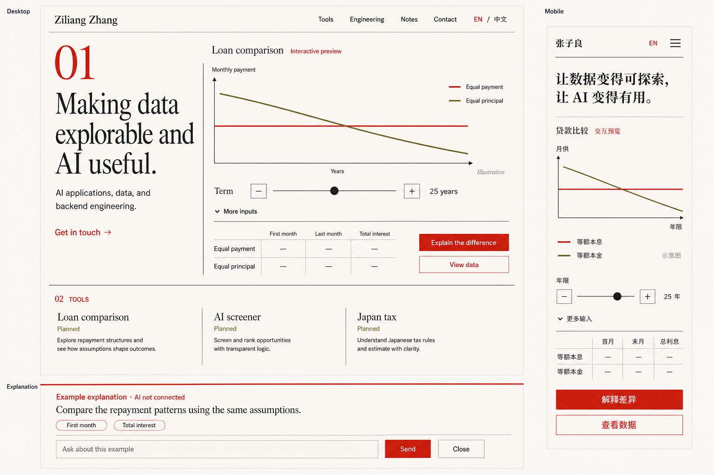
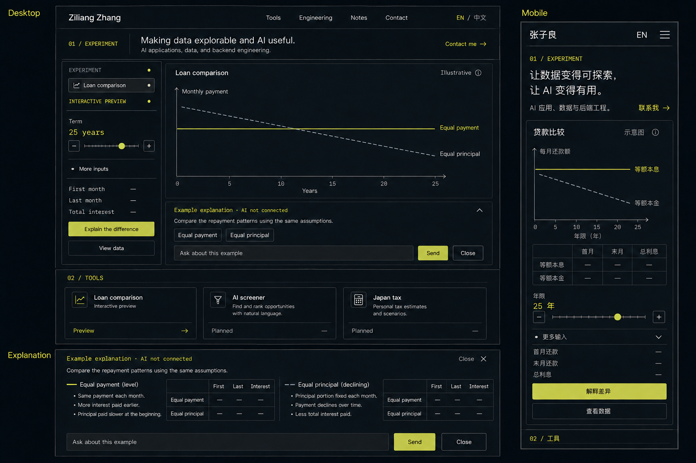
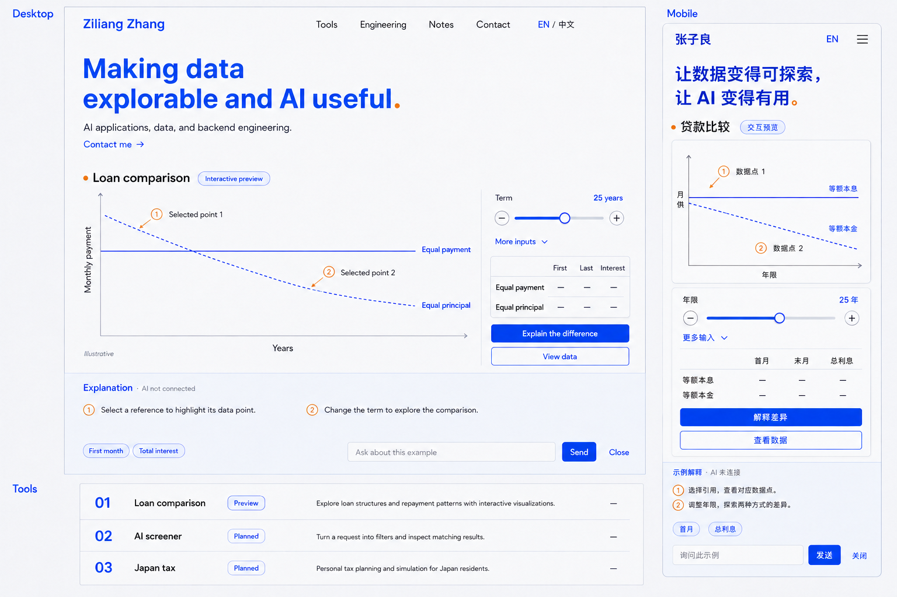

> 最新决策（2026-09-05）：A v2 已获确认；以 [设计规格](./homepage-design-spec.md)、[验收清单](./homepage-acceptance.md) 和 [实现交接](./homepage-implementation-handoff.md) 为当前执行依据。下文早期停止点保留为阶段历史。

# Phase 5A.2 — 三套主页视觉方向

日期：2026-09-05。状态：用户已选择 A，认可其设计感、配色、排版和舒适度，认为 B/C 太极客、繁复并削弱第一眼焦点。B/C 仅保留为探索记录，以下原始比较和建议不再代表当前选择。完整页面见 [A 深化稿](./homepage-a-refinement.md)；尚未批准正式实现。

用户已接受 [Phase 5A.1 信息架构](./homepage-ia.md)，并授权生成视觉方案。本轮使用内置 `image_gen.imagegen`，未使用 API/CLI fallback、未新增依赖、未修改正式主页、未启动 `/goal`。完整初始与修订提示词见 [prompts.json](./visual-directions/prompts.json)。

## 1. 如何看这三套稿

每张 1536×1024 概念板同时包含英文桌面首屏、中文移动首屏，以及 AI 解释展开状态；它们不是可运行页面或精确视口截图。右侧手机区域呈现窄屏内容顺序，没有实体手机装饰。部分展开内容延伸到首屏之后，不能据此声称已通过 390×844 的实际视口验收。

三套使用相同内容：姓名与 AI/数据/后端定位、贷款比较与年限操作、上下文解释、三项工具方向。展示差异来自排版、操作区组织、图表比例和解释呈现方式。工具页、真实 AI、税务和股票数据均未实现。

贷款线条只用于表达比较关系，货币数值保留为横线占位；25 年是图中场景示意，不是已批准的计算器默认值。解释明确标明 AI 未连接。全部截图文案是候选，正式文案与交互契约以 IA 及后续规格为准。

| 方向 | 第一印象 | 布局机制 | AI 的位置 | 最主要取舍 |
| --- | --- | --- | --- | --- |
| A 交互展台 | 有个人气质的技术作品展 | 左侧大字主张、右侧开放图表；工具为分栏目录 | 图表下的编辑式注释 | 身份突出、轻量，但直接的工程感稍弱 |
| B 个人实验室 | 可操作的精密实验仪器 | 顶部短介绍、左控制轨、右图表与分析抽屉 | 紧贴图表的分析区 | 工程气质强，但需控制密度，避免成为后台界面 |
| C 动态画布 | 数据与解释一起响应的个人工具空间 | 横向主张、大图表、对应数据点的编号注释；工具为纵向索引 | 图表下的编号解释，与数据点联动 | 应用体验突出，但响应式注释布局更复杂 |

## 2. A — 交互展台

**设计主张：让一件可以操作的作品，成为个人介绍。**

- 核心隐喻是编辑式作品展：不使用全屏头像背景，以姓名、主张和一幅大图表建立身份。
- 桌面把身份和体验并排，开放图表直接落在页面上；窄屏将大字压缩成两三行后立即呈现图表和滑块。
- 字体方向为有表现力的衬线标题配清晰无衬线正文；中文需选择气质一致、可读的标题字体。暂不锁定具体字体文件。
- 色彩意图为暖白纸面、近黑文字、朱红操作色与橄榄色比较线；浅色是这一方向的基准，不自动承诺双主题。
- 年限变化时仅更新曲线与数据；展开解释像增加一段有引用的注释，使用细线和小标签连接上下文。
- 工具区是开放的三栏目录，下面沿同一编辑式节奏展开工程证据、精选笔记和 Gmail 联系。
- 适配理由：加强个人主页感，让技术内容易于阅读，较少依赖复杂动效。
- 实现风险较低：主要是 CSS 排版和 SVG 图表；中文字体加载、细线对比度、手机表格列宽需验证。大号 01 的面积可收敛，避免压过姓名。

## 3. B — 个人实验室

**设计主张：把技术判断做成一个可操作的实验。**

- 核心隐喻是精密仪器；顶部身份简短，主要空间留给控件、图表和结果。
- 桌面采用横向操作台，参数在左轨，图表和分析在右；移动端恢复图表在前、参数在后的单列顺序。
- 字体方向为人文无衬线正文与有限使用的等宽数字/刻度，不用整页代码字体。
- 色彩意图为石墨底色、暖白文字、少量黄绿色操作色，辅以灰白虚线；使用不透明表面和细边框，避免发光玻璃效果。
- 动效重点是滑块刻度、选定数据点与摘要同步；AI 以分析抽屉在图表下展开，不弹出浮窗。
- 工具区延续紧凑模块，工程区可在同一网格解释计算和数据流；继续向下阅读笔记与联系。
- 适配理由：三套中工程感最直接，有利于快速表达操作、测量与技术严谨性。
- 实现风险中等：暗色文字对比度、细线可见性和信息密度需要实测。不得用灰暗小字承载关键含义；等宽字只用于数字和短标签。避免无关实验选项让它看起来像通用后台。

## 4. C — 动态画布

**设计主张：每一次操作，都能在数据和解释中找到对应。**

- 核心隐喻是可探索的画布；横向标题之后，图表成为主要视觉场域，编号注释指向实际数据位置。
- 桌面保留较宽图表，参数靠近图表一侧；解释作为下方连续区域。移动端将参数放到图后，注释只保留当前选中项，避免互相遮挡。
- 字体方向为鲜明的几何无衬线标题与清晰正文；中文采用相同节奏的无衬线，而不是复制英文字宽。
- 色彩意图为浅灰蓝底、钴蓝标题/操作、炭黑正文、少量橙色引用标记。曲线以实线和虚线区分，不能只靠颜色。
- 代表交互是“选中解释引用 → 对应数据点被定位和突出”；滑块更新图表后，旧解释明确变为待更新状态。没有漂浮的无关图形或持续粒子动画。
- 工具采用纵向编号索引，允许未来筛股器成为主要作品而不需要重做全部卡片；工程、笔记、联系延续开放布局。
- 适配理由：最贴近用户希望的“酷且能快速体现技术含金量”，视觉记忆点与真实操作有直接联系。
- 实现风险中等：图表注释的碰撞、触摸操作、缩放与键盘定位需要重点验证。优先 SVG/HTML，不必为了画布气质引入 WebGL；reduced-motion 下保留同样信息，取消过渡。

## 5. 生成质量检查与后续校准

已逐张检查并做定向图像修订：补充手机 EN 入口，增加两种还款方式的区分，删除不必要的装饰与误导性解释文字。图像生成仍留下少量不符合实施规格的细节，列明如下，不能照图机械实现：

- A 的工具目录将贷款标为 Planned，而首屏为预览；正式设计统一为“主页预览 / 独立工具规划中”，或采用 IA 的 Preview 状态。
- B/C 手机示意线的相对位置仍不完全正确，C 桌面虚线也不够直；真实图表必须由同一组计算结果绘制，不能描摹这些像素。图像中的金融语句亦不作为数值算法或结果验证。
- B 手机有重复指标区，后续只保留一次两种方式对照表，并确保年限控件靠近图表。
- A/B/C 的部分中英文短文案、触控尺寸、字体与颜色值需要在真实页面中核对。当前没有声称通过对比度、键盘、响应式或性能验收。
- 主行动在稿中由显眼的滑块承担，IA 中身份区的“试着调整一下”聚焦入口仍需在细化版补齐；联系完整 Gmail 在页面下方，首屏可使用简短联系链接。
- B/C 画面展示了展开的解释；真实默认状态仍为收起，由用户操作打开。A 的独立 Explanation 区域是展开样式放大示例，不是页面额外重复一份解释。

本轮效果图用于选定总体布局与视觉语言，不代替后续完整中英、桌面/移动高保真稿或浏览器原型。没有将概念图片作为正式主页背景或 UI 资产引用。

## 6. 建议与审阅停止点

主 Agent 倾向 **C 动态画布**：它把吸引力放在操作、数据点和解释的关系上，同时保留个人主页的开放感。A 更适合优先突出个人气质与阅读体验；B 更适合优先强调工程与实验感。

用户此时只需选择 A、B、C 的整体方向，或指出具体不喜欢的布局/气质。选定后在同一方向内深化完整页面与中英适配，补充移动解释展开/关闭和其它关键状态；不把三个方向随意拼成混杂的视觉系统。未经确认不进入 Phase 5A.3 规格、Phase 5A.4 原型或正式实现。
