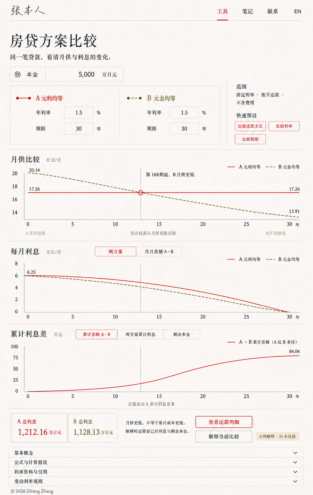

# 房贷比较图表方案（已确认）

2026-09-05。用户确认：公式与基础余额字段、未付利息与逾期责任区分、5 年和 125% 规则的合同边界沿上一轮讨论；引用资料置于工具下方。第一版固定利率、默认共用本金。用户已确认本页的两方案、三联动图布局。用户最新已授权安排独立 worktree 实现；主任务负责正式主页迁移。实现交接见 implementation-handoff.md。

内置 ImageGen 效果图，只表达布局。提示词见 prompts.json。图片曲线形状、交点横坐标、刻度位置和字体并非数值绘图，不能读取为计算结果；正式原型以同一还款表驱动全部图表，使用准确坐标。图中 AI 为明确标注的未连接示例，不构成真实服务授权。

## 图表结构

两方案各有方式、利率、期限，共用本金。三图共享月份选择器：

1. 月供：同时叠加 A、B，标月供交点与首次关系反转的真实月份。
2. 月利息：同时叠加 A、B；切换当期差额 A−B。
3. 累计利息：默认累计差额 A−B；切换两方案累计曲线或剩余本金。余额视图有独立正确标题与图例。

不是每方案一图，也不是将单期与累计量混在同一纵轴。差额图的零点才是对应指标交点。允许无交点、起点相等、重合；离散月度数据区分相等与跨月符号反转。

## 用于解释的准确示例

共同本金 50,000,000 日元，名义年利率 1.5%，360 期；A 元利均等、B 元金均等。按月期末还款，无费用与逐期舍入：

- A 月供 172,560.10522881633 日元。
- B 首期 201,388.88888888888，末期 139,062.5 日元。
- 理论月供交点 m≈167.053793882：第167期仍 A 低，第168期起 B 低，约第14年。
- A 总利息 12,121,637.882373877 日元；B 总利息 11,281,250 日元；差额约840,387.88日元。

结果通过 Python 直接代入公式计算。交点由 A=P/n+[P−P(m−1)/n]r 求解；正式实现同时用还款表验证临界月份。图片里的曲线不能替代该计算。

## 如何描述“更优”

界面输出限定指标的事实：“第168期起 B 月供较低”，不能概括成“第168期起 B 更优”。相同本金、期限、正利率下，B 元金均等首期利息与 A 相同，此后利息更少，因此累计利息差保持非负并增加；月供交点不是累计利息交点。

若问题是“第 t 年卖房/结清，哪个贷款成本低”，应比较截至结清时已付利息，另列提前清偿费用等已支持成本，同时展示待偿本金。无费用情形下，累计还款+剩余本金−初始本金=累计利息；仅比累计还款会混淆已归还本金与融资成本。当前范围不含税收优惠、资金时间价值、投资收益和真实银行费用，不能给综合最优结论。

数据交点和指标结论由确定性逻辑生成，未来 AI 只解释结果快照。不同期限以相同经过时间比较，已结清方案月供为零、累计利息不再增加，结清点明确标记。
