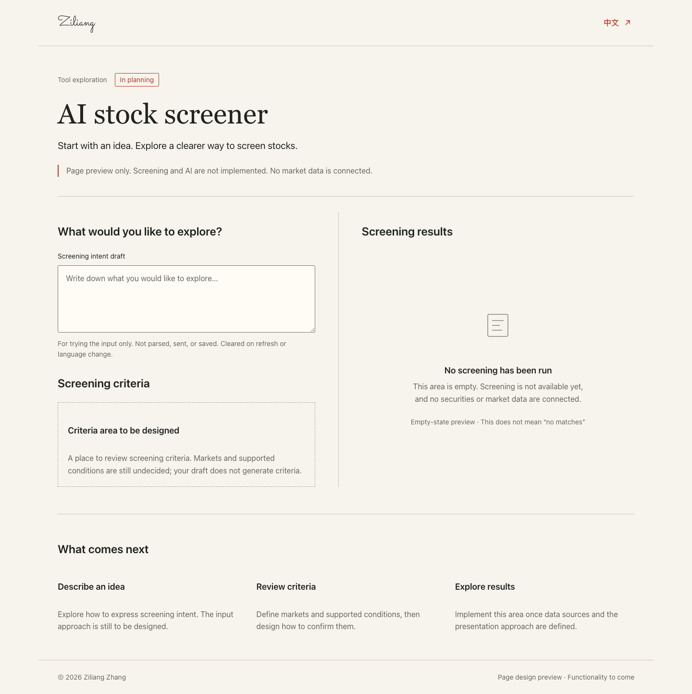
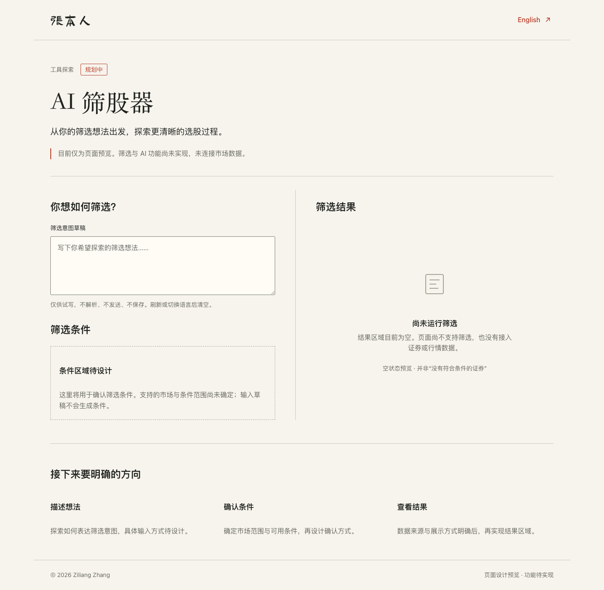
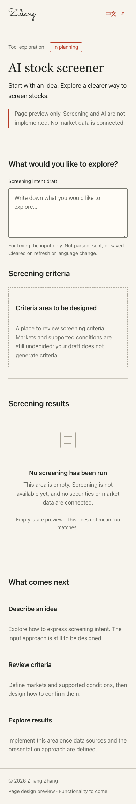
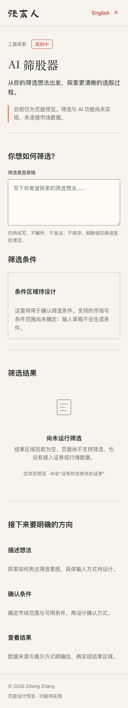

# AI 筛股器空壳交接

2026-09-05。基线 `codex/phase-5a0` / `14c3cae`；独立 worktree `/Users/lucien/.codex/worktrees/fcba/LucienZhang.github.io`。实现已完成；用户已确认保留空壳状态并授权提交。未推送、合并或部署。

## 本地预览

已启动仅绑定本机的静态构建预览：

- [English](http://127.0.0.1:4387/tools/stock-screener.html)
- [中文](http://127.0.0.1:4387/zh/tools/stock-screener.html)

若服务停止，在本 worktree 执行 `npm run build`，然后 `python3 -m http.server 4387 --bind 127.0.0.1 --directory docs/.vuepress/dist`。这些是本地地址，不是公开部署。两个页面都含 `robots: noindex, nofollow`，未添加首页入口。noindex 仅为索引指令；页面会进入本地构建产物，集成者在未来部署前需要另行决定预览页面发布范围。

## 实现与文件范围

- [plan.md](./plan.md)：实施边界与结构。
- `docs/.vuepress/components/tools/stock-screener/StockScreenerShell.vue`：单一原生 Vue 组件、装饰 SVG、完整中英文案、作用域样式。
- `docs/tools/stock-screener.md`、`docs/zh/tools/stock-screener.md`：显式导入组件、对应 locale、专属页面类、noindex，关闭这两页的主题导航、侧栏和页尾元信息。
- 本目录的专属浏览器检查、JSON 实测结果、日志和四张截图。

采用暖白 `#F7F4ED`、朱红 `#B63824`、衬线主标题和系统正文，复用现有 Sacramento / Slidefu 品牌字体。桌面双栏、900px 以下单栏，390px 与 320px 可读。页脚年份固定为本次 2026 设计预览年份。

页面有用途与规划中状态、可试写的意图文本域、条件占位、结果空状态和后续方向。文本域使用浏览器本地临时内容，没有 Vue 状态持久化、事件提交或发送行为；提示刷新与语言切换会清空。语言链接前往对应本工具页面。焦点顺序为跳转链接、品牌首页链接、语言链接、文本域。SVG 仅为装饰，不表示数据。

没有修改 Home.vue、首页导航、全局主题样式、其他工具目录、依赖、锁文件或公共测试脚本。组件内三条 `:global` 规则均以唯一 `.stock-screener-page` 页面类限定，只处理这两页的现有主题容器宽度、padding、页尾；不改变全站主题 tokens，不注册公共布局或公共工具框架。

## 未实现范围

没有筛选逻辑、自然语言解析、后端、模型、行情 API、数据库、条件生成、模拟结果或假加载。没有提交按钮、证券样本、价格、命中数或指标列集合。结果空状态明确区分“未运行”与“无匹配”。没有选定市场或数据源，也没有涉及贷款工具或 AI 解释器架构。

## 实测结果

| 检查 | 结果 |
| --- | --- |
| `npm ci --no-audit --no-fund` | 退出 0；按现有锁文件安装，未改依赖；npm 提示部分依赖安装脚本未获批准，但后续构建成功 |
| `npm run verify` | **退出 1，未整体通过**。构建成功，内部链接检查通过（52 HTML、5414 引用）；artifact 检查仅报新增两条路由不在旧 50 页基线中，无缺失路由 |
| `npm run check:security`（单独执行） | 通过 |
| `npm run check:smoke`（单独执行） | 通过，7 条既有路由；首次受沙箱端口监听限制，放行本地测试后重跑成功 |
| 专属 `check-browser.mjs` | 通过：Chrome，中英文各 1440×900、1280×720、768×1024、390×844、320×844，均无横向页面溢出 |
| 交互 | Tab 顺序、Shift+Tab、Enter 语言切换、跳至内容、标签与描述关联、可见焦点通过；输入未发出请求，条件与结果不改变，语言切换后输入为空 |
| 渲染 | 中英各路由 noindex、单一 h1；深色偏好仍为暖白、文本域前景正确；200% 根字号检查无横向溢出；英文禁用 JS 后核心文字存在 |
| 网络与控制台 | 专属两页检查无外部请求、HTTP 4xx/5xx、console error 或运行时异常 |
| `git diff --check` | 通过；修改范围仅本任务新增文件 |

根字号 200% 检查不等同于浏览器原生缩放或全面 WCAG 审计。未做真人屏幕阅读器、Safari、Firefox 或实际手机硬件检查；不为空壳编写筛选算法测试。专属测试初次因 CSS class 顺序断言失败，改为无关顺序的比较后完整通过；页面实现未因此改变。

证据：[browser-results.json](./browser-results.json)、[verify.txt](./validation/verify.txt)、[security.txt](./validation/security.txt)、[smoke.txt](./validation/smoke.txt)。构建保留既有大 bundle 警告。

专属浏览器检查需要外部 Playwright 安装，不要求修改仓库依赖：

```sh
PLAYWRIGHT_MODULE=/absolute/path/to/playwright/index.mjs PREVIEW_ORIGIN=http://127.0.0.1:4387 node .ai/tools/stock-screener/check-browser.mjs
```

本次使用 Codex bundled Playwright 和本机 Chrome。

## 截图（真实构建页面，完整页面截图）

### English · 1440×900



### 中文 · 1440×900



### English · 390×844



### 中文 · 390×844



四张均已人工视觉检查：品牌、语言入口、状态、文本域、条件与结果空状态、后续方向、页脚均完整，无截图裁切或文本重叠。手机完整页长于首屏，结果区正常随页面滚动访问。

## 集成交接：共享文件最小补丁建议（未应用）

现有 `scripts/check-build-output.mjs` 严格比较 `.ai/baseline/2026-09-04/routes.txt`。如用户批准将这两条预览路由纳入集成，建议由集成任务应用：

```diff
--- a/.ai/baseline/2026-09-04/routes.txt
+++ b/.ai/baseline/2026-09-04/routes.txt
@@
 /programming/prog-lang/scope.html
+/tools/stock-screener.html
 /zh/index.html
@@
 /zh/projects/werewolf.html
+/zh/tools/stock-screener.html
```

同时将公共脚本最后的固定文案 `the 50-route baseline` 换为模板中的 `the ${expectedRoutes.length}-route baseline` 时，须将 `expectedRoutes` 提升到当前块外才能引用；更小的补丁是直接改为 `the route baseline`，避免误报页数。该日志改动不影响检查行为。

不建议为了本空壳绕过路由检查或删掉基线。除这项验证清单更新外，不需要共享运行时代码补丁。若暂不纳入共享基线，保持当前已记录的 verify 失败，仍可独立审阅本地页面。

## 后续需要用户明确的问题（本空壳无需等待）

- 目标市场、证券范围及是否覆盖多个市场？
- 支持哪些条件、输入与确认方式？
- 使用哪个数据源，授权范围、更新频率及缺失数据如何处理？
- 结果需要展示什么内容、怎样解释数据来源与限制？

这些决定留待后续产品任务，不在本实现预设答案。

## 官方文档核对

- [VuePress frontmatter](https://vuepress.vuejs.org/reference/frontmatter.html)：页面 head 元信息与布局约定。
- [VuePress Markdown and Vue SFC](https://vuepress.vuejs.org/advanced/cookbook/markdown-and-vue-sfc)：Markdown 中显式导入 SFC。
- [Playwright Keyboard](https://playwright.dev/docs/api/class-keyboard)、[Screenshots](https://playwright.dev/docs/next/screenshots)：浏览器输入与截图 API。

已结合当前安装的 VuePress client 与默认主题源码核对，不使用未经支持的 `layout: false` 或注册新全局布局。
